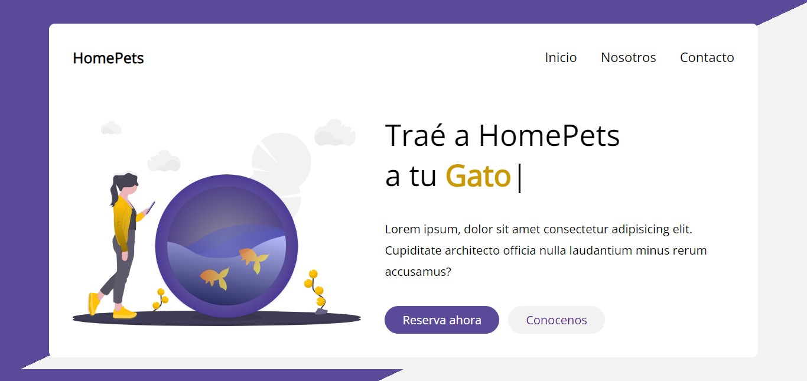

# Efecto de Escritura (ANIMADA) con JAVASCRIPT 

### Screenshot

### Live 
- [Live demo](https://jeraldinnemg.github.io/efecto-escritura/)

### Recursos
- [TypedJS](https://github.com/mattboldt/typed.js/)

### Tecnologías usadas:
HTML5
CSS3
JavaScript
TypedJS

### [Tutorial: https://youtu.be/bSHitSCqWr8](https://youtu.be/bSHitSCqWr8)

